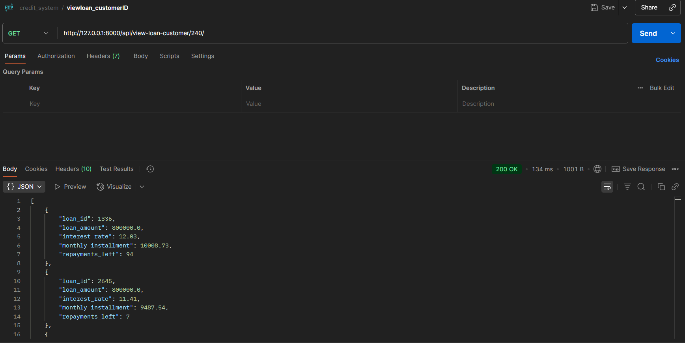
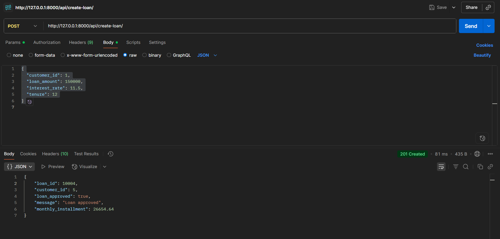
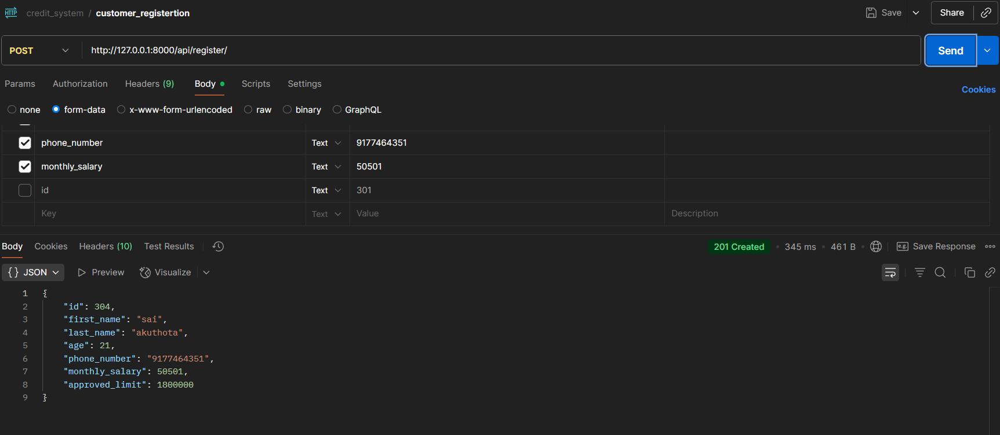
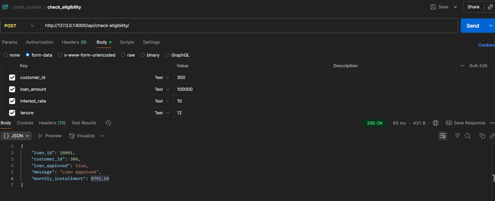
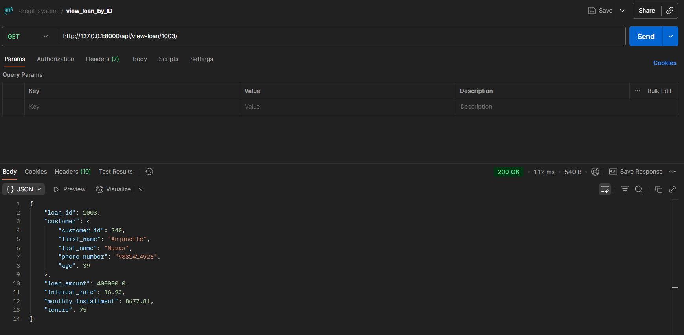

# 🏦 Credit Approval System

A robust Django-based web application to manage customers, evaluate loan eligibility based on credit history, and process loan approvals with real-time EMI and credit score calculations.

---

## 📌 Table of Contents
- [🚀 Features](#-features)
- [🛠 Tech Stack](#-tech-stack)
- [🧠 Business Logic](#-business-logic)
- [📡 API Endpoints](#-api-endpoints)
- [📥 Installation & Setup](#-installation--setup)
- [🏃 Running the App](#-running-the-app)
- [🧪 Running Tests](#-running-tests)
- [📚 Usage Examples](#-usage-examples)
- [📷 Screenshots](#-screenshots)
- [🤝 Contributing](#-contributing)
- [📄 License](#-license)

---

## 🚀 Features

- ✅ Customer registration with PostgreSQL-backed persistence.
- 📊 Loan eligibility checking using custom business rules.
- 💰 EMI and credit score calculations based on historical loan data.
- 📥 Create new loan if eligible.
- 📄 View loan by ID and customer.
- ✅ Clean API structure with Django REST Framework.
- ✅ Organized code with separation of concerns.
- 🧪 Includes unit tests for API endpoints.

---

## 🛠 Tech Stack

| Layer            | Technology          |
|------------------|---------------------|
| Backend          | Django, DRF         |
| Database         | PostgreSQL          |
| API Testing      | Postman / curl      |
| Task Automation  | Python unittest     |

---

## 🧠 Business Logic

Credit score is calculated based on:
1. ✅ Timely repayment of previous loans.
2. 🔁 Number of loans taken in the past.
3. 📆 Loans active in the current year.
4. 💸 Total volume of approved loans.
5. ❌ If sum of active loans exceeds the approved limit → credit score = 0.

**Loan Approval Rules:**

| Credit Score      | Approval Condition                          |
|-------------------|----------------------------------------------|
| > 50              | ✅ Approve                                    |
| 31 - 50           | Approve only if interest rate ≥ 12%         |
| 11 - 30           | Approve only if interest rate ≥ 16%         |
| ≤ 10              | ❌ Reject                                     |
| > 50% of salary as EMI | ❌ Reject                                |

---

## 📡 API Endpoints

| Endpoint                          | Method | Description                          |
|-----------------------------------|--------|--------------------------------------|
| `/api/register-customer/`        | POST   | Register a new customer              |
| `/api/check-eligibility/`        | POST   | Check loan eligibility               |
| `/api/create-loan/`              | POST   | Create a new loan if eligible        |
| `/api/view-loan/<loan_id>/`      | GET    | View specific loan with customer     |
| `/api/view-loans/<customer_id>/` | GET    | View all loans of a customer         |

---

## 📥 Installation & Setup

### Requirements:
- Python 3.9+
- PostgreSQL (running locally)
- Virtualenv

### Steps:

```bash
# Clone the repo
git clone https://github.com/Chakrasai/credit_approval_system.git
cd credit_approval_system

# Setup virtual environment
python -m venv venv
source venv/bin/activate  # On Windows: venv\Scripts\activate

# Install dependencies
pip install -r requirements.txt

# Setup environment variables
cp .env.example .env
# Edit .env file with your actual database credentials

# Run migrations
cd credit
python manage.py makemigrations
python manage.py migrate

# Create superuser
python manage.py createsuperuser

# Start the server
python manage.py runserver
```

---

## 🏃 Running the App

After successful installation:

1. **Start the Django development server:**
   ```bash
   cd credit
   python manage.py runserver
   ```

2. **Access the application:**
   - API Base URL: `http://127.0.0.1:8000/api/`
   - Admin Panel: `http://127.0.0.1:8000/admin/`

3. **Create a superuser (optional):**
   ```bash
   python manage.py createsuperuser
   ```

---

## 🧪 Running Tests

Run the test suite to verify everything is working correctly:

```bash
# Run all tests
python manage.py test

# Run tests with verbose output
python manage.py test --verbosity=2

# Run tests for specific app
python manage.py test core
```

---

## 📚 Usage Examples

### Register a Customer
```bash
curl -X POST http://127.0.0.1:8000/api/register-customer/ \
  -H "Content-Type: application/json" \
  -d '{
    "first_name": "John",
    "last_name": "Doe",
    "age": 30,
    "monthly_income": 50000,
    "phone_number": "9876543210"
  }'
```

### Check Loan Eligibility
```bash
curl -X POST http://127.0.0.1:8000/api/check-eligibility/ \
  -H "Content-Type: application/json" \
  -d '{
    "customer_id": 1,
    "loan_amount": 100000,
    "interest_rate": 10,
    "tenure": 12
  }'
```

### Create a Loan
```bash
curl -X POST http://127.0.0.1:8000/api/create-loan/ \
  -H "Content-Type: application/json" \
  -d '{
    "customer_id": 1,
    "loan_amount": 100000,
    "interest_rate": 12,
    "tenure": 12
  }'
```

### View Loan Details
```bash
curl -X GET http://127.0.0.1:8000/api/view-loan/1/
```

### View Customer's All Loans
```bash
curl -X GET http://127.0.0.1:8000/api/view-loans/1/
```

---

## 🤝 Contributing

We welcome contributions! Please follow these steps:

1. **Fork the repository**
2. **Create a feature branch:**
   ```bash
   git checkout -b feature/your-feature-name
   ```
3. **Make your changes and commit:**
   ```bash
   git commit -m "Add: your feature description"
   ```
4. **Push to your branch:**
   ```bash
   git push origin feature/your-feature-name
   ```
5. **Create a Pull Request**


---

## 📷 Screenshots

### API Endpoints Overview


### Customer Registration


### Loan Eligibility Check


### Loan Creation Process


### Loan Details View


---
- Write clear, descriptive commit messages
- Add tests for new features
- Update documentation as needed
- Follow PEP 8 style guidelines

---

## 📄 License

This project is licensed under the MIT License - see the [LICENSE](LICENSE) file for details.

---

## 🙏 Acknowledgments

- Built with [Django](https://djangoproject.com/) and [Django REST Framework](https://www.django-rest-framework.org/)
- Database powered by [PostgreSQL](https://postgresql.org/)
- Thanks to all contributors who helped improve this project

---

## 📞 Support

If you encounter any issues or have questions:

1. Check the [Issues](https://github.com/Chakrasai/credit_approval_system/issues) page
2. Create a new issue if your problem isn't already reported
3. Provide detailed information about your environment and the issue

---

**⭐ If you found this project helpful, please give it a star!**


